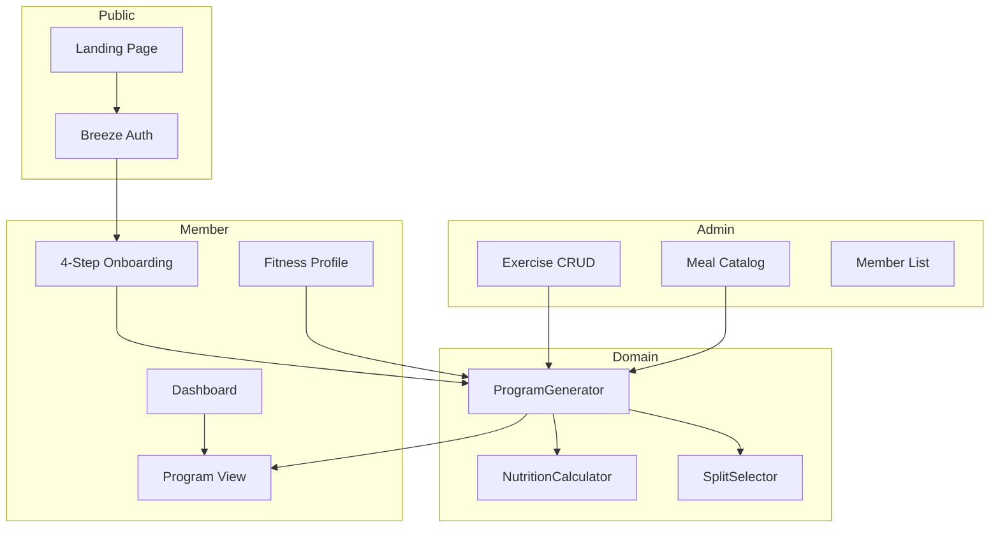

# Gym Project — Persian Fitness Platform

[](https://github.com/parsaghasemii/Gym-project/actions/workflows/ci.yml)
[](https://www.php.net/)
[](https://laravel.com/)
[](LICENSE)

Persian RTL web platform for a single gym: member onboarding, rule-based **4-week workout + nutrition program generation**, member dashboard, and admin catalog management.

Built as a product-style MVP — not a generic CRUD tutorial.

---

## Highlights

| Area | What it demonstrates |
|------|----------------------|
| **Domain logic** | Rule-based program engine (split selection, equipment filtering, muscle-focus prioritization, Mifflin-St Jeor nutrition) |
| **Product flow** | Landing → register → 4-step onboarding → auto-generated program → dashboard → profile edit → regenerate |
| **UI/UX** | Full Persian RTL, IRANSans, responsive mobile layouts, design system, FAQ chat widget |
| **Engineering** | Laravel 13, PHP 8.3 enums, service layer, middleware gates, 40+ automated tests, CI pipeline |
| **Documentation** | Product spec, architecture diagram, setup guide, seeded demo data |

---

## Preview

| Landing | Program | Admin |
|---------|---------|-------|
|  |  |  |

> Replace these SVG previews with real screenshots/GIFs after deployment for maximum impact on recruiters.

---

## Architecture



**Core flow:** onboarding collects profile data → `ProgramGenerator` selects split type, filters exercises by equipment/level, prioritizes muscle groups, calculates daily macros, persists a 4-week program aggregate.

Full product spec: [`docs/gym.md`](docs/gym.md)

---

## Tech Stack

- **Backend:** PHP 8.3, Laravel 13, Laravel Breeze (Blade)
- **Frontend:** Tailwind CSS 3, Alpine.js, Vite 5
- **Database:** SQLite (local dev; schema ready for MySQL)
- **Testing:** PHPUnit, Laravel feature + integration tests
- **Tooling:** Laravel Pint, GitHub Actions CI, Dependabot

---

## Features

### Member
- Persian RTL landing page with FAQ chat widget
- Register / login / logout (email verification disabled in v1)
- 4-step onboarding wizard with server-side validation
- Automatic 4-week program generation (training + nutrition)
- Dashboard with quick actions and program summary
- Fitness profile edit + program regeneration

### Admin
- Exercise CRUD (muscle group, equipment, difficulty, sets/reps/rest)
- Meal catalog (read-only list in v1)
- Member list + create member accounts

### Program Engine
- Split types: Full Body (3d) · Upper/Lower (4d) · PPL + Focus (5d)
- Equipment-aware exercise filtering
- Fitness level difficulty gating
- Muscle-focus volume prioritization
- Mifflin-St Jeor BMR → TDEE → goal-adjusted macros

---

## Quick Start

### Requirements

- PHP 8.3+ (`mbstring`, `openssl`, `pdo_sqlite`, `sqlite3`, `xml`, `curl`)
- Composer
- Node.js 20+ (or Node 18 with the pinned Vite 5 toolchain)
- SQLite

Ubuntu/Debian:

```bash
sudo apt install php8.3-sqlite3
```

If system SQLite is unavailable, this repo includes a fallback under `.php-ext/` used by `./serve.sh` and `./scripts/php.sh`.

### Setup

```bash
git clone git@github.com:parsaghasemii/Gym-project.git
cd Gym-project

cp .env.example .env
composer install
php artisan key:generate
touch database/database.sqlite
php artisan migrate --seed
npm install
npm run build
./serve.sh
```

Open [http://127.0.0.1:8000](http://127.0.0.1:8000).

Use `./serve.sh` instead of `php artisan serve` when the system PHP SQLite extension is missing.

### Demo Admin

Configure in `.env` (never commit real passwords):

| Variable | Default |
|----------|---------|
| `ADMIN_EMAIL` | `admin@gym.local` |
| `ADMIN_PASSWORD` | `password` |
| `ADMIN_NAME` | `مدیر باشگاه` |

Run `php artisan db:seed` to create or update the admin user.

---

## Testing

```bash
php artisan test
```

Or with the local PHP fallback:

```bash
./scripts/php.sh vendor/bin/phpunit
```

CI runs Pint (code style) + full test suite on every push to `main`.

---

## Project Structure

```
app/
├── Enums/           # Domain enums (Equipment, Goal, SplitType, …)
├── Http/
│   ├── Controllers/ # Web + Admin controllers
│   └── Middleware/  # Onboarding + admin gates
├── Models/          # Eloquent models + relationships
├── Services/        # ProgramGenerator, NutritionCalculator, SplitSelector
└── Support/         # PersianDate, ValidationPresenter

resources/views/     # Blade templates (RTL, component-based)
tests/Feature/       # HTTP + integration tests
tests/Unit/          # Unit tests for support classes
docs/gym.md          # Product specification
```

---

## Deployment Notes

This MVP targets SQLite for local development. For production:

1. Switch `DB_CONNECTION` to MySQL/PostgreSQL in `.env`
2. Set `APP_ENV=production`, `APP_DEBUG=false`
3. Run `php artisan migrate --force` and `npm run build`
4. Configure a web server (Nginx/Apache) or use Laravel Forge / Railway / Render

Suggested next step for portfolio impact: deploy a live demo and add the URL here.

---

## Roadmap (v2 ideas)

- [ ] Live demo deployment
- [ ] Meal admin CRUD
- [ ] Injury-aware exercise exclusion
- [ ] Progress tracking (weight logs, PR history)
- [ ] Email verification + notifications
- [ ] API layer for mobile app

---

## Third-party assets

Exercise demonstration GIFs in `database/seeders/assets/exercises/` are sourced from the free [ExerciseDB](https://oss.exercisedb.dev/docs) dataset (AscendAPI). Attribution is required for non-commercial use; see their license terms before commercial deployment.

---

## License

MIT — see [LICENSE](LICENSE).
